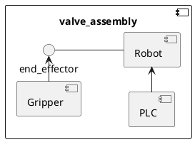

# Interface diagram

Parts:
- Gripper
- Robot
- Jig
- PLC
- Valve
- Sensor(s)

```plantuml
@startuml pickup_parcel_from_coveyor
skinparam backgroundColor transparent
left to right direction
component valve_assembly {

    [Gripper]
    Gripper -> ()end_effector

    [Robot]
    ()end_effector -- Robot

    [PLC]
    PLC -> Robot

}
@enduml
```
