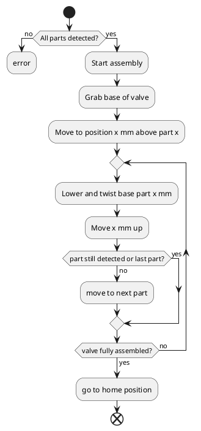

# Proces flowchart

Flowchart van het proces
start wanneer er op de startknop wordt gedrukt

```plantuml
@startuml

start
if (All parts detected?) then (no)
    :error;
    detach
else (yes)
    :Start assembly;
    :Grab base of valve;
    :Move to position x mm above part x;
    repeat
        :Lower and twist base part x mm;
        :Move x mm up;
        if (part still detected or last part?) then (no)
            :move to next part;
        else (yes)
        endif
    repeat while (valve fully assembled?) is (no) not (yes)
:go to home position;
end

@enduml


```