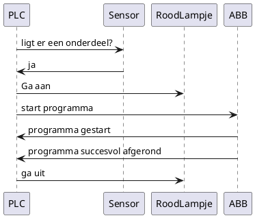

# Sequence diagram

dit is een sequence diagram

```plantuml
@startuml bert_and_ernie

PLC->Sensor : ligt er een onderdeel?
Sensor->PLC : ja
PLC->RoodLampje : Ga aan
PLC->ABB : start programma
ABB->PLC : programma gestart
ABB->PLC : programma succesvol afgerond
PLC->RoodLampje : ga uit

@enduml
```
