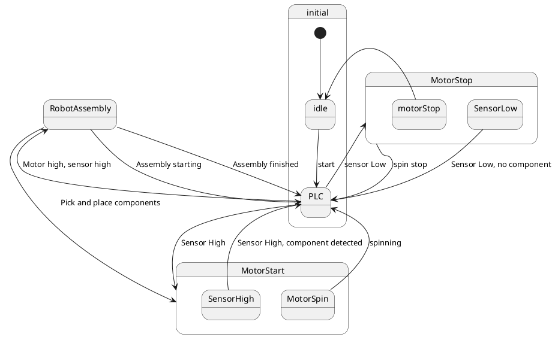

# State machine

```plantuml
@startuml

State initial {
[*]-down->idle
idle -down->PLC : start 
}

state MotorStart {
  SensorHigh-up->PLC: Sensor High, component detected
  PLC-down->MotorStart: Sensor High
  MotorSpin-down->PLC : spinning
}
state RobotAssembly{
  PLC-up->RobotAssembly: Motor high, sensor high 
  RobotAssembly-down->PLC: Assembly starting 
  RobotAssembly-down->MotorStart: Pick and place components
  RobotAssembly-down->PLC: Assembly finished 
}

state MotorStop {
  SensorLow-down->PLC: Sensor Low, no component
  PLC-down->MotorStop : sensor Low 
  MotorStop-down->PLC: spin stop
  motorStop-down->idle
}

@enduml


```

