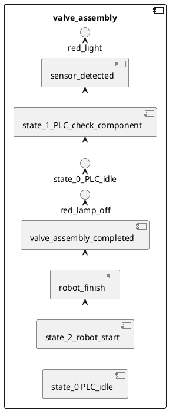

# State machine

```plantuml
@startuml state
skinparam backgroundColor transparent
left to right direction
component valve_assembly {
  [state_0 PLC_idle]  
  [state_1_PLC_check_component]
  state_0_PLC_idle -> state_1_PLC_check_component 
  [sensor_detected]
  state_1_PLC_check_component ->sensor_detected 
  sensor_detected -> () red_light
  [state_2_robot_start] 
  [robot_finish] 
  [valve_assembly_completed] 
  state_2_robot_start->robot_finish
  robot_finish->valve_assembly_completed 
  valve_assembly_completed -> () red_lamp_off 
  ()red_lamp_off-> state_0_PLC_idle 
}
@enduml

```
