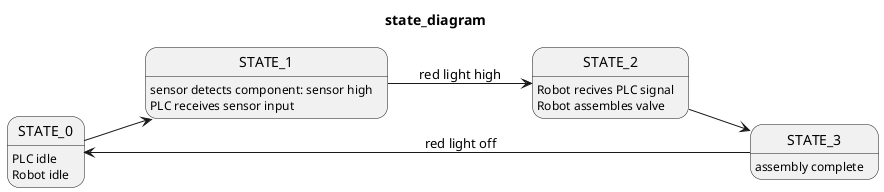

# State machine

```plantuml
@startuml

skinparam backgroundColor transparent
left to right direction

title state_diagram


STATE_0 :PLC idle
STATE_0: Robot idle

STATE_0 --> STATE_1


STATE_1 : sensor detects component: sensor high
STATE_1 : PLC receives sensor input

STATE_1 --> STATE_2: red light high


STATE_2: Robot recives PLC signal
STATE_2: Robot assembles valve

STATE_2--> STATE_3
STATE_3 :assembly complete


STATE_3-->STATE_0: red light off 


@enduml

```
